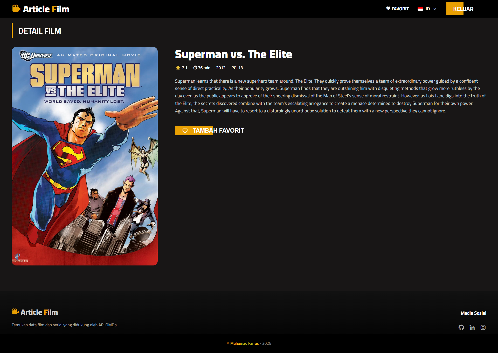
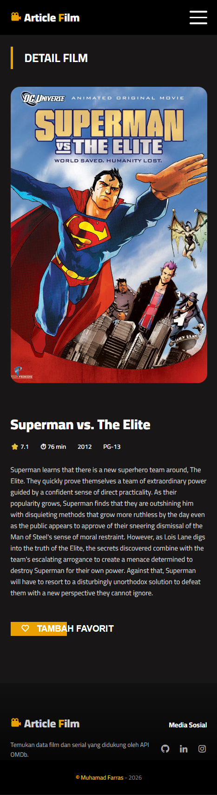
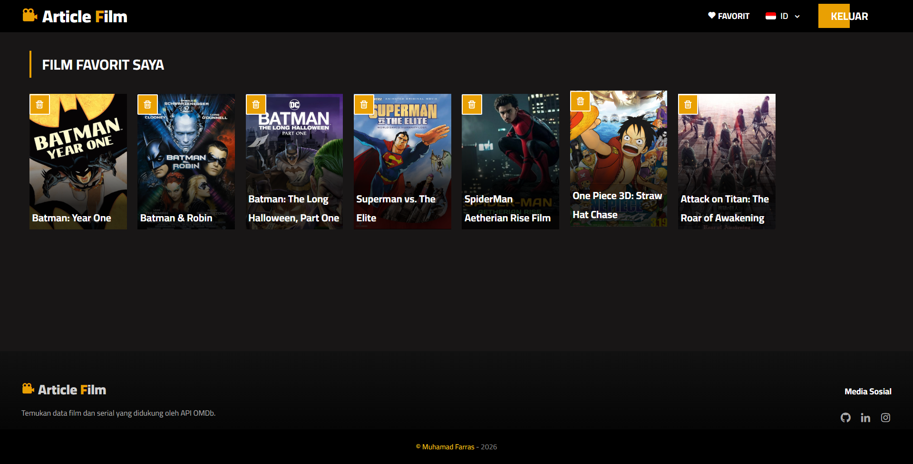
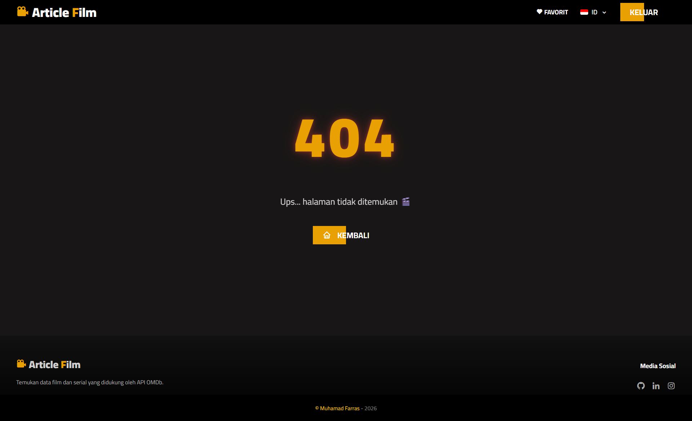
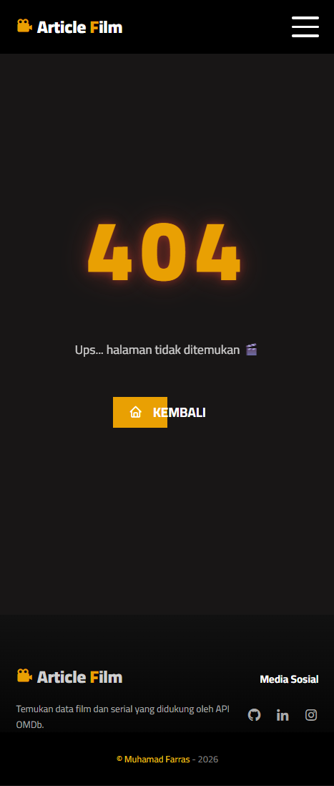
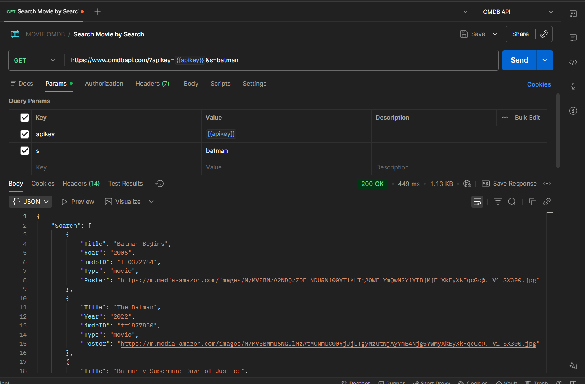

# OMDb-API | Article Film

**Article Film** is a movie discovery web application powered by the **OMDb API**, built with **Laravel 5.5** using a clean **Service-Oriented Architecture**.

Users can search movies, view detailed information, manage favorites, and enjoy a responsive multilingual interface.

---

## 🚀 Features

- Movie Search (OMDb API)  
- Movie Detail Page  
- Session-based Favorite System  
- Infinite Scroll  
- Multi-language (EN / ID)  
- Hero Carousel  
- Fully Responsive UI  
- Custom 404 Page  

---

## 🧠 Architecture

This project applies **Service-Oriented Architecture** on top of Laravel MVC:

```
Controller → Service Layer → OMDb API
```

All API communication is centralized in:

```
app/Services/OmdbService.php
```

### Advantages
- Cleaner controllers  
- Reusable business logic  
- Easier maintenance  
- Better scalability  

---

## 🧰 Tech Stack

### Backend
- Laravel 5.5  
- PHP >= 7.0  
- Guzzle HTTP Client  
- Session Management  

### Frontend
- Blade Template Engine  
- Owl Carousel  
- Boxicons  
- Custom CSS & Vanilla JavaScript  

🎥 API: https://www.omdbapi.com/

---

## 📚 Core Libraries

| Library | Purpose |
|--------|------------|
| laravel/framework | Core framework |
| guzzlehttp/guzzle | HTTP client for OMDb |
| fideloper/proxy | Trusted proxy support |
| laravel/tinker | Debugging |
| phpunit / mockery | Testing |

---

## 🌍 Multi-Language

Supported languages:

- 🇺🇸 English  
- 🇮🇩 Indonesian  

Implemented using **Laravel Localization + custom SetLocale middleware** with session persistence.

---

# 📸 Screenshots

Folder structure:

```
docs/screenshots/
```

---

## 🏠 Home Page

<table>
<tr>
<td align="center"><b>Desktop</b></td>
<td align="center"><b>Mobile</b></td>
</tr>
<tr>
<td></td>
<td></td>
</tr>
</table>

---

## 🎬 Movie Detail

<table>
<tr>
<td align="center"><b>Desktop</b></td>
<td align="center"><b>Mobile</b></td>
</tr>
<tr>
<td></td>
<td></td>
</tr>
</table>

---

## ❤️ Favorite Movies

<table>
<tr>
<td align="center"><b>Desktop</b></td>
<td align="center"><b>Mobile</b></td>
</tr>
<tr>
<td></td>
<td></td>
</tr>
</table>

---

## 🚫 404 Page

<table>
<tr>
<td align="center"><b>Desktop</b></td>
<td align="center"><b>Mobile</b></td>
</tr>
<tr>
<td></td>
<td></td>
</tr>
</table>

---

## 📬 API Documentation (Postman)



---

## ⚙️ Installation

```bash
git clone https://github.com/mfarrass/OMDb-API.git
composer install
cp .env.example .env
php artisan key:generate
```

Add your OMDb API key:

```
OMDB_API_KEY=eee41fe7
OMDB_BASE_URL=http://www.omdbapi.com/
```

Run the application:

```bash
php artisan serve
```

Open in browser:

```
http://127.0.0.1:8000
```

---

## 👨‍💻 Author

**Muhamad Farras**  
GitHub: https://github.com/mfarrass
